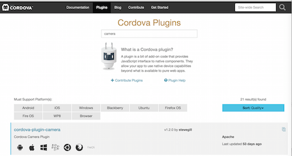
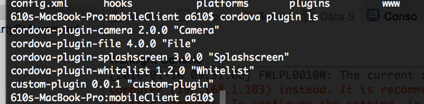
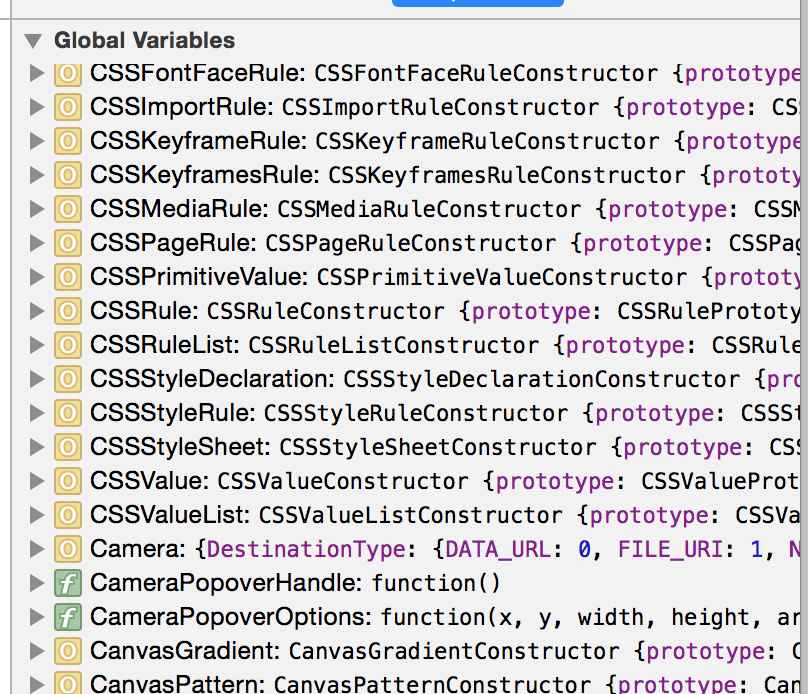
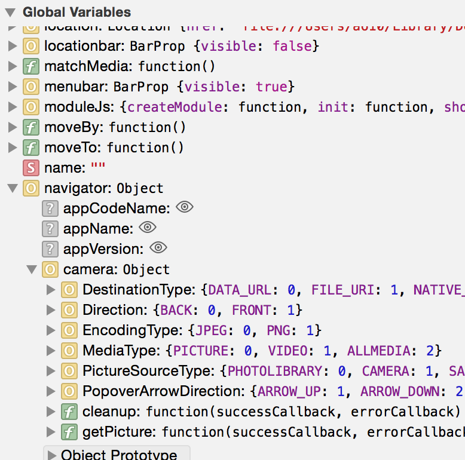
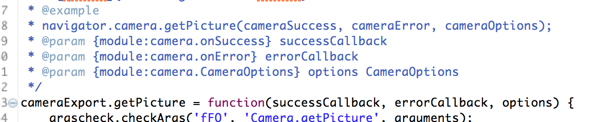

经常在各个Cordova群里发现有人问这个plugin咋用啊。为啥我用出错呀。那个问为啥我用出错呀。

然后各路去跪求各路大神求良方，要么就是抱怨，Cordova不好用，什么破玩意，不如appcan或者原生。

究其原因。就是这类人得了一种病，很严重的病，此类病友有一个通俗的名字------`伸手党`

什么都要别人给你做好，做成即插即用的，按上以后不需要调整最好。拿来就可以满足自己的业务需要。

恨不得直接拿来改一些图片和文字就可以上线自己的应用了。但是我要问一句【别人都给你做了，那还要你干什么？】

本着授人与鱼不如授人与渔的原则，我写了这个blog，这篇blog的目的是教会大家如何去用plugin以及了解plugin

本文主要以Cordova-plugin-camera作为例子来讲述如何使用第三方plugin以及如何解决问题的思路。

#如何安装cordova的plugin 
这对于大部分有工作经验的人来说都不是困难的事情，但是对于一个彻头彻尾的伸手党来说，这是一个大问题。而他们的理由往往是【我不是新手嘛？】

首先如何去查找自己需要的plugin，以cordova-plugin-camera为例，首先去官网的plugin下面

我个人建议是你点进去看一眼人家的README.MD 
然后回到命令行执行如下命令 
$cd project_path 
$cordova plugin add cordova-plugin-camera 
$cordova plugin ls  /*这个命令主要是用于查看plugin是否安装成功*/

#如何使用安装的plugin 
我始终强调一点那就是一定要看plugin的readme。开源虽然给广大开发者很大方便，但是也存在不足，那就是不稳定或者是无法得到有效的技术支持。
 
这个时候readme就显得尤为重要。你可以从中获得非常重要的信息，比如cordova-plugin-camera这个plugin就是。 
很多人关于这个插件第一个问题就是，为什么我安装插件以后使用出错。找不到camera？为什么camera为undefined？ 
这就好比买东西不看说明书一样。遇到问题先骂街。然后去找人问。问不到就说人家产品不好。而人家说明书里面明明都写了。 
这个时候又有人出来说了，我看不懂英语，英语看不懂，上面代码总该能看懂吧？ 

下面一个典型的问题：getPicture不存在 
这里我给他家提供的是一个解决问题的思路，同样可以运用到其他plugin上面 
首先我们需要查看一下camera对象是否挂到我们的主界面window上面，只有挂到window上面我们才可以直接使用它。 
我们现在程序主入口处设置一个断点。然后运行到此处。通常我的建议是deviceready的这里。 
然后查看dom树： 

看看我们发现了什么？plugin提供了一些全局api。等等。但是并没有找到我们需要的getPicture函数。开始翻readme。 
`deviceready` event.

    document.addEventListener("deviceready", onDeviceReady, false);
    function onDeviceReady() {
        console.log(navigator.camera);
    }
哦，原来camera被挂到了window.navigator上面了。好吧。那我们就看看navigator对象上是否有我们要的东西。 

现在基本上就找到如何调用plugin的api的方法了。那么关于如何使用这个方法。还有另外一个问题。如何使用。 

从源代码里面我们可以很轻易的找到这个api定义的位置(如何找到的？很多工具都有目录下检索文件内容的功能吧？) 
然后？然后？然后就是根据你的需要设置参数传进去在两个回调函数取结果啦。 

这里我强烈建议不要将failedCallback设置成null。如果你设置成null那么出了问题，你就不知道哪里除了问题了 
群里经常有人问。我调用plugin不起作用啊。怎么回事啊，求大神帮忙。你写的代码。别人怎么能知道为什么不起作用呢？ 